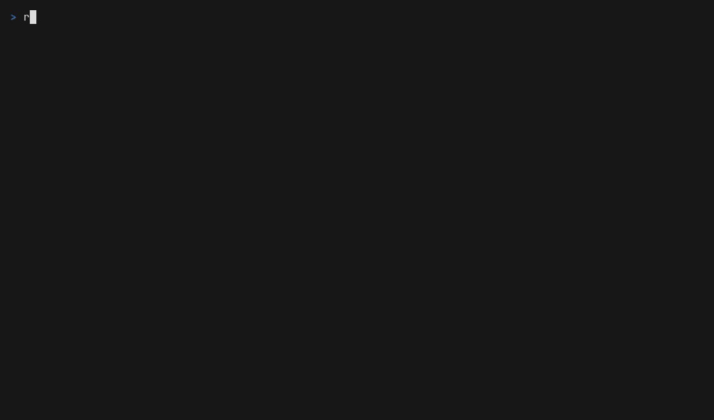

# re:SES



<sub>Enter connects and opens, `i` saves the inbox, Enter opens a message, `q` goes back. All the mail is synthetic.</sub>

A terminal inbox for the raw email that Amazon SES stores in S3.

SES can drop every incoming message into an S3 bucket, but what lands there is the raw RFC 5322 text: pages of `Received:`, DKIM and ARC headers, MIME boundaries and base64. Run `reses` and it opens an inbox over the bucket, so you can read and delete that mail without downloading anything by hand... and if you do have a stored message on disk, it can decode that too.

Rust 1.98+ is needed to build it, but you never need Rust installed, since every build runs in Docker.

## Usage

```
reses                            open the inbox (in a terminal, this is all you need)
reses FILE [FILE ...]            optional: decode stored messages instead
```

## The inbox

```
reses
```

No file or path is needed.

1. **Pick an account.** It lists the profiles in `~/.aws/credentials`. `a` adds one: the keys you type are written back to that file in the standard AWS format. Other profiles, comments and layout stay as they were, and the file is kept at mode 0600. `d` makes a profile the default.
2. **Find the mail.** Browse buckets and folders. Objects that are stored email get marked as you scroll, and `s` searches down from the current folder for the folders that hold email.
3. **Save the inbox.** `i` saves the current bucket and folder. From then on, `reses` opens straight into it.

The inbox shows From, Subject, Date and Size, newest first. Enter opens a message, `d` deletes it from S3 after you confirm with `y`, `/` filters, `r` refreshes, and `u` goes back to the accounts. In a message, `h` switches to the HTML part, `w` saves the text and `a` saves the attachments, both into `~/Downloads`.

Settings live in `~/.config/reses/config.toml` (`$RESES_CONFIG` or `$XDG_CONFIG_HOME` move it). `$AWS_SHARED_CREDENTIALS_FILE` and `$AWS_CONFIG_FILE` are honoured the way the AWS CLI honours them.

## Decode a stored message (optional)

If you have a raw message file, for example one downloaded from the bucket, reses can print it readably instead of opening the inbox:

```
reses FILE [FILE ...]            print each message
reses FILE -o out.txt            write to a file
reses FILE --html                show the HTML part instead of plain text
reses FILE --save-attachments D  write attachments into D
cat FILE | reses                 read from stdin
```

```
From: Alice <alice@example.com>
Reply-To:
To: bob@example.org
Cc:
Bcc: hidden@example.org
Date: Fri, 25 Sep 2026 17:01:31 -0700
Subject: Hello there
Message-ID: <id-1@example.com>
Message:

plain body
```

Bcc never survives delivery as a header, so I work it out from the envelope recipients (`Delivered-To`, `X-Original-To`, and the `for <addr>` in `Received`) that aren't already in To or Cc.

The output matches `python/reses.py` byte for byte. That script was the first version of reses, and it stays in the repo as the reference: the mail goldens in `tests/fixtures/mail/` come from it.

## Download

Ready-to-run binaries for Linux (x86_64 and arm64, static) and macOS (Apple Silicon) are on the [releases page](https://github.com/spdrman/reses/releases), with install steps and checksums in each release's notes.

## Build and install

Everything runs in Docker through `scripts/ci-docker.sh`, and the Makefile wraps it:

```
make gate          fmt, clippy, check, docs, tests, python oracle tests
make integration   the S3 tests, against a throwaway MinIO
make darwin        cross-build the macOS binary into dist/ and check it against the goldens
make install       make darwin, then link ~/.local/bin/reses to dist/reses
make demo          re-record docs/demo.gif against a throwaway MinIO, failing unless the checked snapshots show the inbox
```

`~/.local/bin` has to be on your PATH. If something is already there under that name, `make install` leaves it alone and tells you to move it aside first.

On macOS, never install a new build by `cp` over an existing copy. Once a binary has run, overwriting its file in place while any process holds it open (a `reses` that is still running, or Docker Desktop, which holds everything under a mounted folder) makes macOS kill it on every later launch, silently, with exit 137. `make install` links to `dist/reses`, and every build is renamed into place on a new file, so it never hits this. If you copy a binary somewhere yourself, copy to a new name and `mv` it over the old one. See #15.

## License

MIT, see [LICENSE](LICENSE).
